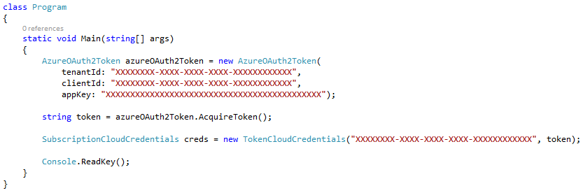

# SmartAzureOAuth2  
Azure OAuth2 helper to obtain acess token.  
  
## Usage  
  
First, you need to install the NuGet package, you can do it with that command:  
```
Install-Package SmartAzureOAuth2  
```
  
  

## How to create a package  
  
You will need the *NuGet command line tool* then visit this [NuGet](https://docs.nuget.org/consume/command-line-reference) link to obtain and install this tool.  
  
1) Clone the project `git clone https://github.com/JulioGold/SmartAzureOAuth2.git`.  
  
2) Build project SmartAzureOAuth2 at **Release** mode.  
  
3) With the prompt command, navigate to => **SmartAzureOAuth2\src\SmartAzureOAuth2\NuGetPkg**  
  
4) At this directory, run the following command: `nuget.exe pack SmartAzureOAuth2.nuspec -Prop Configuration=Release`  
  
5) It's done, the **SmartAzureOAuth2.0.0.1.nupkg** file will be create at this directory.  
  
Danke 
  